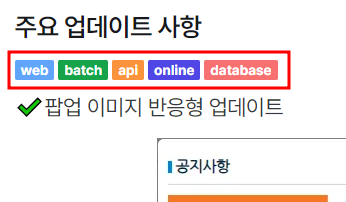

# 문서 작성 가이드

개발자센터의 문서는 [Markdown]() 문법의 확장인 [MDX](https://mdxjs.com/) 형식으로 작성되어 있습니다.\
`Layout`의 경우 `src/layouts/docs/domain/Layout.astro` 경로의 파일을 열어서 수정해주시면 됩니다.\
`src/content/docs/[lang]/_nav.yaml` 파일을 열어서 좌측 네비게이션 메뉴 항목을 수정할 수 있습니다.

## 에디터 환경 구성하기

개발자센터의 문서는 ESLint와 Prettier, remark-lint를 통해 포매팅과 린팅이 이뤄집니다.

## 컴포넌트 활용하기

개발자센터에서는 편리한 문서 작성을 위해 다양한 컴포넌트들을 사용할 수 있습니다.

### `<Badge>`
\

프로젝트명을 명시하기 위한 컴포넌트 입니다.\
Badge 사용 후, Header 가 없는 경우 줄바꿈('\'')을 사용하여 다음 문장을 작성합니다.\
여러 개를 사용하는 경우 이어서 작성합니다.

5 가지 스타일을 지원합니다.\
"web" | "batch" | "api" | "online" | "database"

```tsx
import Badge from "/src/components/Badge.astro";

//Header 컴포넌트가 있는 경우
<Badge style={'web'}>프로젝트명</Badge>
## 제목입니다.
    
//Header 컴포넌트가 없는 경우
<Badge style={'batch'}>프로젝트명</Badge>\
내용입니다.

<Badge style={'api'}>프로젝트명</Badge>
<Badge style={'online'}>프로젝트2명</Badge>

<Badge style={'web'}>web</Badge>
<Badge style={'batch'}>batch</Badge>
<Badge style={'api'}>api</Badge>
<Badge style={'online'}>online</Badge>
<Badge style={'database'}>database</Badge>
```

### `<Figure>`
테두리가 씌워진 배경을 그리는 컴포넌트 입니다.\
선택적으로 캡션 텍스트를 추가할 수 있습니다.

```tsx
import Figure from "~/components/Figure.astro";

import image from "./screenShot.png";

<Figure
  src={image}
  caption="이미지" // 생략 가능
  width="300" // 생략 가능, 생략 권장
/>;
```


### `<Hint>`
유의사항 등을 표현하기 위해 박스를 그리는 컴포넌트 입니다.\
작성한 글을 박스 안에 넣을 수 있습니다.\
4 가지 타입을 지원합니다.\
"info" | "warning" | "success" | "danger"

```tsx
import Hint from "/src/components/Hint.astro";

<Hint style="etc">
  📘 **릴리즈노트는 서비스 배포의 일정과 내용을 기록하는 서비스 입니다.**
</Hint>

```

## 문서 작성 규칙

### 시맨틱한 마크다운 작성하기

마크다운과 MDX는 HTML 형태로 출력되는, 고유의 시맨틱을 가진 언어입니다.
각 마크다운 문법의 시맨틱을 준수해서 문서를 작성해주세요.

- **Unordered List(`-`) 남용하지 않기**

  UL 문법은 가급적이면 항목이 여러 개인 경우에 대해서만 사용하시는 것을 권장 드립니다.

- **Unordered(`-`)/Ordered(`1.`, `2.`, ...) List 상황에 맞게 사용하기**

  순서가 명확한 목록 컨텐츠를 작성할 경우에는 Ordered를, 이외의 경우에는 Unordered를 사용해주세요.

- **Blockquote(`>`)를 시각적 효과를 위해 사용하지 않기**

  Blockquote 문법은 인용구를 위한 문법으로 용도가 철저히 제한되는 문법입니다.
  시각적 효과는 HTML + CSS를 통해서 구현해주세요.

### 이미지는 `import`해서 사용하기

개발자센터에는 `import`를 통해 가져온 이미지를 압축 및 최적화하는 절차가 세팅되어 있습니다.
이 절차는 이미지를 `` 등의 방식으로 경로를 지정하여
가져오는 경우에는 적용되지 않는데, 이 경우 페이지의 성능 및 데이터 사용량 등이 크게 저하되니
가급적이면 `import`를 대신 사용해 주시기 바랍니다.
이때 이미지 파일은 해당 MDX 파일이 속한 폴더에 `_assets` 폴더를 생성하여,
적절한 이름과 함께 추가하시는 것을 권장합니다.

```tsx
// 1. <Figure> 컴포넌트 사용하기 (권장)
import Figure from "~/components/Figure.astro";

import logo from "./_assets/sample.png";

<Figure src={logo} caption="샘플 로고" />;

// 2. <Image> 컴포넌트 직접 사용하기
import { Image } from "astro:assets";

import logo from "./_assets/sample.png";

<Image src={logo} alt="샘플 로고" />;
```

### 코드 블럭에 올바른 언어 이름 사용하기

개발자센터의 마크다운 코드 블럭은 [Prettier][]에 의해 포매팅되며,
[Shiki][]에 의해 하이라이팅됩니다. 가급적이면 두 툴링을 모두 지원하는 언어를 사용하여
코드 블럭을 작성해 주세요.

- [Prettier에서 지원되는 언어 확인하기](https://prettier.io/docs/en/)
- [Shiki에서 지원되는 언어 목록](https://shiki.matsu.io/languages)

사용하시는 언어가 Prettier에 의해 지원됨에도 정상적으로 포매팅이 이뤄지지 않을 경우,
다음을 의심해볼 수 있습니다.

- 문법 오류가 있어 정상적으로 포매팅이 이뤄지지 않고 있을 수 있습니다.
  문법 오류를 수정해주세요.
- `eslint-plugin-mdx`가 언어 이름을 정상적으로 파싱하지 못할 수 있습니다.

[Prettier]: https://prettier.io
[Shiki]: https://shiki.matsu.io

### 중복된 내용의 문서 작성 최소화하기

- **중복/공통된 내용 컴포넌트화하기**

  문서를 작성하다 보면 중복/공통된 내용을 여러 번 작성하게 되는 경우가 있습니다.
  이 경우 중복/공통된 내용을 별도의 MDX 파일로 분리하여 작성한 후,
  해당 내용을 사용할 파일에서 위 파일을 `import`해서 컴포넌트 형태로 활용해주세요.

    - **주의사항**

      개발자센터에서는 [prose라는 컴포넌트 모음][prose]을 활용해서 MDX에서 렌더링될
      HTML 요소들의 스타일을 지정하는데, 별도로 분리된 MDX 파일들은
      페이지 단위 파일들과 달리 해당 컴포넌트들을 다음과 같이 수동으로 세팅해주어야 합니다.

      ```tsx
      import * as prose from "~/components/prose";
  
      export const components = prose;
      ```

## 문서 작성 샘플
```md
---
layout: /src/layouts/release-notes/Layout.astro
title: 릴리즈노트 샘플
releasedAt: 2024-00-00
writtenAt: 2024-07-19
---


import Badge from "/src/components/Badge.astro";
import Figure from "/src/components/Figure.astro";
import { Aside } from '@astrojs/starlight/components';

import sample1 from "./_assets/sample.png";
import sample3 from "./_assets/sample3.svg";

{/*프로젝트 명, 같은 내용이 여러 프로젝트에서 진행될 경우 ', '로 구분*/}
<Badge style={'web'}>web</Badge>
<Badge style={'batch'}>batch</Badge>
<Badge style={'api'}>api</Badge>
<Badge style={'online'}>online</Badge>
<Badge style={'database'}>database</Badge>
### ✔️제목 샘플 입니다.
<Figure src={sample3} caption={"팝업 이미지"}/>
이미지가 추가될 경우, Header 바로 밑에 입력해주세요.

<Aside>
    ```mdx
    // A code snippet, for example.
    ```
</Aside>

<Badge style={'web'}>vmms</Badge>
<Badge style={'web'}>biz</Badge>
### ✔️팝업 이미지 반응형 업데이트
<Figure src={sample1} caption={"팝업 이미지"}/>
팝업 이미지의 해상도가 접속한 환경에 따라 조정되도록 반응형으로 변경되었어요.\
접속한 브라우저 환경에 따라 팝업의 해상도가 자동으로 바뀝니다.\
[VMMS-운영자판기 관리](https://vmms.ubcn.co.kr/service/ServiceOVM) 페이지에서 확인하실 수 있습니다.
<br/>

<Badge style={'devapi'}>개발API</Badge>
### ✔️개발API 설정 변경
팝업 이미지의 해상도가 접속한 환경에 따라 조정되도록 반응형으로 변경되었어요.\
접속한 브라우저 환경에 따라 팝업의 해상도가 자동으로 바뀝니다.\
[VMMS-운영자판기 관리](https://vmms.ubcn.co.kr/service/ServiceOVM) 페이지에서 확인하실 수 있습니다.
<br/>
```